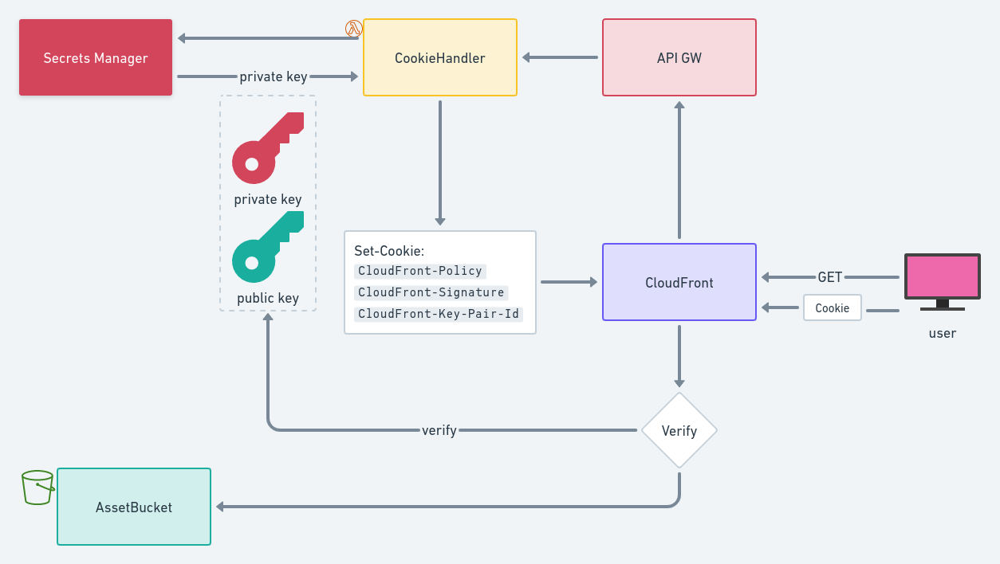

# Static Website



## Public - Private key pair

Generate by

```sh
openssl genrsa -out private_key.pem 2048
openssl rsa -pubout -in private_key.pem -out public_key.pem
```

- **private key** goes into SSM for use by Lambda to sign the cookie
- **public key** goes to CloudFront (`AWS::CloudFront::PublicKey` and `AWS::CloudFront::KeyGroup`)

## CloudFront Distribution

- `Origins`: Locations where content is stored, and from which CloudFront gets content to serve to viewers.
- `CacheBehaviors`: Each cache behavior specifies the one origin from which you want CloudFront to get objects.

## Cookie Lambda@Edge

### Limitations

Lambda@Edge

- does not support environment variables.
- must be in us-east-1
- cannot be in VPC
- cannot be referenced with `$LATEST$`; must use a version number

---

`LambdaFunctionAssociations: 'viewer-request'` 

Needs to return `Set-Cookie` header with values

- `CloudFront-Policy`
- `CloudFront-Signature`
- `CloudFront-Key-Pair-Id`

