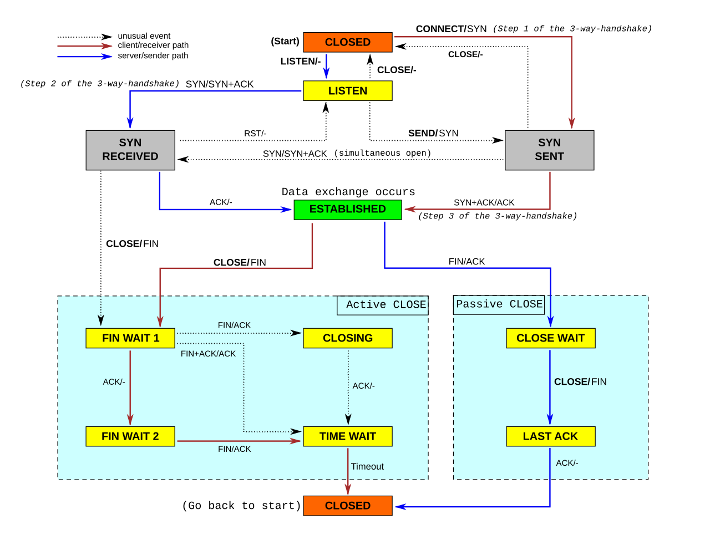

# Network

- `ip link list`
- `ip address show`
- `ip neigh show` ARP table
- `ip route show`

Default gateway is know throught the word **via** in the output.


## OSI

|||
|-|-|
|**Userspace**||
|Layer 7|Application|
|Layer 6|Presentation|
|Layer 5|Session|
|**Kernel**||
|Layer 4|Transport|
|Layer 3|Network|
|Layer 2|Data Link|
|**Physical**||
|Layer 1|Physical|

The 7 layer model is outdated, in preference of the 4 layer model. The only important legacy is the numbering system.

## Routing Table

A list of every Layer 3 network the router knows about and how to get there.

`ip rule list` lists the rules.

By default there are 3 tables: *main*, *local* and *default*. ip tool modifies main and local.

`ip route list table main`

route tables are in */etc/iproute2/rt_tables*.

`ip route get <ip>` shows kernel's routing for an ip.

A router has a *Forwarding Information Base* (**FIB**) and a *Routing Information Base* (**RIB**). A router uses the RIB (in the *Control Plane*) to determine optimized, best routing rules.

**Note**: FIB is not the same as routing table. A routing table maps IPs to a route - a FIB knows which headers to put on the packet.

### Example

```
echo 200 John >> /etc/iproute2/rt_tables
```

creates a table *John*.

```
ip rule add from 10.0.0.10 table John
```

creates a rule for *John* table.

Now `ip rule ls` will also list

```
32765:	from 10.0.0.10 lookup John
```

## IP

These IPs are reserved for private use ([RFC 1918](https://datatracker.ietf.org/doc/html/rfc1918))
```
     10.0.0.0        -   10.255.255.255  (10/8 prefix)
     172.16.0.0      -   172.31.255.255  (172.16/12 prefix)
     192.168.0.0     -   192.168.255.255 (192.168/16 prefix)
```

Similar for IPv6 is [RFC 4193](https://datatracker.ietf.org/doc/html/rfc4193).

loopback 127.0.0.1 address is so that the system can talk to itself and do self diagnostics.

## Random commands

```
sudo ss -nltpu
```

```
nstat
```

## DHCP

UDP, then Port 67 and 68 unicast.

1. DHCP Discover (broadcast)
2. DHCP Offer (broadcast beacuse no ip assigned yet): network information such as client ip, subnet mask, default gateway ip, dns ip, ip lease time, dhcp server ip
3. DHCP Request: approves the ip
4. DHCP Ack (broadcast) with same information as in offer

dhcpd deprecated in favor of kea.

## DNS

DNS - Domain Name System. Communicates on port 53.

Traditionally resolvconf, but replaced with systemd-resolved.

On Ubuntu `/etc/resolv.conf` is a link to `/run/systemd/resolve/stub-resolv.conf`.

systemd-resolved.service

```
resolvectl status
```

DHCP is to dynamically get an IP. It communicates on ports 67 and 68.

If DHCP, then DNS server will be set automatically.

```
dhclient
```

### letsencrypt and ACME

letsencrypt uses ACME protocol ([RFC 8555](https://datatracker.ietf.org/doc/html/rfc8555)).

## Network Interface

Each connection to a node is called a "network interface". Linux gives these names like "eth0". `ip a` lists them.

The first of theese `lo` (loopback) represents the linux host itself.

- `UP` means that the kernel thinks the interface is up
- `LOWER_UP` means that we have established a link at the physical layer; an electrical signal.

## Protocols

- TCP
- UDP
- ICMP
- BGP for updating routing tables (Bird)

---

## CS144

Biderectional, reliable byte stream.

Byte Stream Model.

HTTP document centric. Verbs and folder structure.

Packets: data and header.

4 layer model

||||
|-|-|-|
|Application|Biderectional reliable byte stream between two applications|HTTP, SMTP, SSH, FTP|
|Transport|Guarentees correct, in-order delivery of data end-to-end. Controls congestion|TCP, UDP, RTP|
|Network|Delivers datagrams end-to-end. Best-effor - no guarantees|Must use IP|
|Link|Delivers data over a single link|Ethernet. WiFi, DSL, 3G|

A router uses a Forwarding Table.

**Packet switching**: Independently for each arriving packet, pick its outgoing link. If the link is free, send it. Else hold the packet for later.

**Flow**: A collection of datagrams belonging to the same end-to-end communication.

**Connection**: ?

#### Making the Network Layer Work

1. The IP protocol
    - Creation of IP datagrams
    - hop-by-hop delivery from end to end
2. Routing Tables
    - Algorithm to populate forwarding tables
3. ICMP
    - Communicates network layer information between end hosts and routers
    - Reports error conditions
    - Helps in diagnosing problems

### IP

- Datagram
- Unreliable
- Best effort
- Connectionless

IP makes no guarantees; that is the concern of the transport layer.

IP Service Model:

1. Tries to prevent looping forever (TTL)
2. Will fragments if they are too long
3. Uses a header checksum to reduce chances od delivering datagram to wrong destination
4. Allows for new versions of IP
5. Allows for new options to be added to header

```
Bit 0
    0                   1                   2                   3
    0 1 2 3 4 5 6 7 8 9 0 1 2 3 4 5 6 7 8 9 0 1 2 3 4 5 6 7 8 9 0 1
   +-+-+-+-+-+-+-+-+-+-+-+-+-+-+-+-+-+-+-+-+-+-+-+-+-+-+-+-+-+-+-+-+
   |Version|  IHL  |Type of Service|          Total Length         |
   +-+-+-+-+-+-+-+-+-+-+-+-+-+-+-+-+-+-+-+-+-+-+-+-+-+-+-+-+-+-+-+-+
   |         Identification        |Flags|      Fragment Offset    |
   +-+-+-+-+-+-+-+-+-+-+-+-+-+-+-+-+-+-+-+-+-+-+-+-+-+-+-+-+-+-+-+-+
   |  Time to Live |    Protocol   |         Header Checksum       |
   +-+-+-+-+-+-+-+-+-+-+-+-+-+-+-+-+-+-+-+-+-+-+-+-+-+-+-+-+-+-+-+-+
   |                       Source Address                          |
   +-+-+-+-+-+-+-+-+-+-+-+-+-+-+-+-+-+-+-+-+-+-+-+-+-+-+-+-+-+-+-+-+
   |                    Destination Address                        |
   +-+-+-+-+-+-+-+-+-+-+-+-+-+-+-+-+-+-+-+-+-+-+-+-+-+-+-+-+-+-+-+-+
   |                   (Options)                   |   (Padding)   |
   +-+-+-+-+-+-+-+-+-+-+-+-+-+-+-+-+-+-+-+-+-+-+-+-+-+-+-+-+-+-+-+-+
IPv4 Datagram

IHL: Header Length
```

### Principle: Layering

Is the name we give to the organization of the system into a number of functional components or "layers".
Layers are hiearchial and communicate sequentially. Ie, each layer has only an interface to the layer directly above/below.

Each layer provides a service and abstracts it in an interface for the layers above.

Layering creates

- enables modularity (breaks down into smaller more manageable modules)
- well-defined service (provides interface towards layer above)
- reuse (layers below can be reused)
- separation of concerns (caring about its own job without caring how other layers do theirs)
- continuous improvement

### Principle: Encapsulation

When combining layering and packet switching.

### Endianess

- **LSB** Least Significant Byte or Little-Endian
- **MSB** Most Significant Byte or Big-Endian

Network packets are Big-Endian.

### Netmask

Netmasks tells you witch IPs are local, or if packets needs to go through a router.

**CIDR** Classless Inter-Domain Routing has powers of 2.

IANA is responsible of giving out /8s to RIRs.

### Router

A router have many links. To devcide on which link to forward packets, it uses *Longest Prefix Match*.
This is used to decide which link to take in a **Forwarding Table**. A Forwarding Table consists of two parts: a CIDR entry, and a *next-hop* for that CIDR entry.
The *default* route is the least specific match.

### ARP

Hosts needs to keep a mapping between MAC address and IP address.

### TCP

3-way-handshake:

1. SYN
2. SYN + ACK
3. ACK

A stream of bytes are delivered using TCP segments.

Teardown:

1. A sends FIN to B
2. B continues to send Data + ACK (if it needs to)
3. B sends FIN
4. A sends ACK

|Property|Behavior|
|-|-|
|Stream of bytes|Reliable byte delivery service|
|Reliable delivery| <ol><li>ACK indicate correct delivery<li>Checksums detect corrupted data<li>Sequence numbers detect missing data<li>Flow-control prevents overriding reciever</ol>|
|In-sequence|Data delivered to application in sequence transmitted|
|(Congestion Control)|Controls network congestion|

```
 0                   1                   2                   3
 0 1 2 3 4 5 6 7 8 9 0 1 2 3 4 5 6 7 8 9 0 1 2 3 4 5 6 7 8 9 0 1
+-+-+-+-+-+-+-+-+-+-+-+-+-+-+-+-+-+-+-+-+-+-+-+-+-+-+-+-+-+-+-+-+
|          Source Port          |       Destination Port        |
+-+-+-+-+-+-+-+-+-+-+-+-+-+-+-+-+-+-+-+-+-+-+-+-+-+-+-+-+-+-+-+-+
|                        Sequence Number                        |
+-+-+-+-+-+-+-+-+-+-+-+-+-+-+-+-+-+-+-+-+-+-+-+-+-+-+-+-+-+-+-+-+
|                    Acknowledgment Number                      |
+-+-+-+-+-+-+-+-+-+-+-+-+-+-+-+-+-+-+-+-+-+-+-+-+-+-+-+-+-+-+-+-+
|  Data |       |C|E|U|A|P|R|S|F|                               |
| Offset| Rsrvd |W|C|R|C|S|S|Y|I|            Window             |
|       |       |R|E|G|K|H|T|N|N|                               |
+-+-+-+-+-+-+-+-+-+-+-+-+-+-+-+-+-+-+-+-+-+-+-+-+-+-+-+-+-+-+-+-+
|           Checksum            |         Urgent Pointer        |
+-+-+-+-+-+-+-+-+-+-+-+-+-+-+-+-+-+-+-+-+-+-+-+-+-+-+-+-+-+-+-+-+
|                           [Options]                           |
+-+-+-+-+-+-+-+-+-+-+-+-+-+-+-+-+-+-+-+-+-+-+-+-+-+-+-+-+-+-+-+-+
|                                                               :
:                             Data                              :
:                                                               |
+-+-+-+-+-+-+-+-+-+-+-+-+-+-+-+-+-+-+-+-+-+-+-+-+-+-+-+-+-+-+-+-+
TCP packet
```

The 5-tuple: (src addr, src port, dst port, dps addr, protocol) is a globally unique identifier of the connection. There is however a small chance that it could overlap a previous connection that has lingered on the net (eg in a router's buffer), therefore TCP also sends an initial sequence number (ISN) to minimize the chance of an ID-overlap.

### UDP

```
 0      7 8     15 16    23 24    31
+--------+--------+--------+--------+
|     Source      |   Destination   |
|      Port       |      Port       |
+--------+--------+--------+--------+
|                 |                 |
|     Length      |    Checksum     |
+--------+--------+--------+--------+
|
|          data octets ...
+---------------- ...

     User Datagram Header Format
```

UDP checksum includes pieces of information from the IP layer, thus violating the layering principle. The upshot is that that UDP protocol can detect if datagrams were delivered to the wrong destination.

|Property|Behavior|
|-|-|
|Connectionless Datagram Service|No connection established. Packets may show up in any order.|
|Self contained datagrams||
|Unreliable delivery|<ol><li>no ACK<li>No mechanism to detect missing or mis-sequenced datagrams<li>No Flow-control</ol>|

UDP prvides a simple datagram serice between processes. It is mostly used in cases where the datagram is self contained, eg DNS, NTP and DHCP.

### ICMP

Internet Control Message Protocol.

Transport layer protocol.

Used by ping and traceroute.

|Property|Behavior|
|-|-|
|Reporting Message|Self-contained message reporting error|
|Unreliable|Simple datagram service - no retries|

#### Traceroute

ICMP error message data takes the IP header and the first 8 bites of the IP payload. It then adds the headers Type and Code.

Client sends an UDP message with TTL set to 1. The next hop will return an ICMP message with the IP headers and the first 8 bytes of the original message - this information is enough for the client to figure out which was the original UDP message.
The client continues to do this with increasing TTL.
When reaching the host the client has deliberately chosen a strange port, so that the host will return an ICMP message "port unreachable".

### End-to-End Principle

First described by Saltzer, Reed and Clark in 1984.
Two principles: Weak and Strong.

The weak principle says that the network can only provide extra features if it has information about what the endpoints wants to achieve. Eg security can only be done correctly if the end applications does it.

The string principle says that nothing extra should be done in the network.
"The network's job is to transmit datagrams as efficiently and flexibly as possible. Eerything else should be done at the fringes..." - RFC 1958

The Strong End-to-End Principle makes extending network is easier (SOLID).

### Error Detection: 3 schemes

At a hight level, error detection bits are calculated over the payload data, and is then appended or prepended to the payload.

Networks in general uses 3 different error detection algorithms:

- Checksums adds up all the bytes (TCP and IP)
    - fast and easy to compute
    - not robust
- CRC, Cyclic Recundancy Codes (Ethernet)
    - A CRC of length c can detect any 2 bit errors, any burst of errors < c bits long, any odd number of errors.
- MAC, Message Authentication Codes (TLS)
    - combines the message with some secret information to generate a value
    - robust to malicious modifications
    - any 2 messages have 2^(-c) chance of having the same code
    - Ceyptographically strong; not good for detection errors

### Finite State Machine (FSM)

Commonly used when specifying network protocols and systems.

A **state** is a particular configuration of the system. The system can only be in 1 state.

**Edges** define how to transition between states. It includes information about *events* causing state transition, and *actions* taken on state transition.



### Flow Control

Don't send more packets than receiver can process. Receiver gives sender feedback.

Two basic approaches:

- Stop and wait
- Sliding window

#### Stop and Wait

At most 1 packet in flight at any time.

Reciever recieves data and sends ACK.
Sender sends data, then waits for ACK until sending next. If no ACK is received until a timeout, it sends the packet again.

A bad scenario is if the ACK get received after the timeout, which triggers both a resend, and a send of new data. If one of those messages gets lost, and only one ACK is received from those, this could result in duplicates.

1-bit counter is an approach to handle this scenario, but it is only reliable if the network does not duplicate the package and packets are not delayed multiple timouts.

#### Sliding Window

- A generalization of stop-and-wait: allow multiple un-acked segments.
- Bound on number of un-acked segments, called **window**.
- Sliding Window can keep the pipe full, ie utilizing the receiver's full potential.
- Uses *cumulative acknowledgments*.
For sender:

Every segment has a sequence number **SeqNo**.

Sender maintains 3 variables:

- **SWS**: Send Window Size
- **LAR**: Last Acknowledgment Received
- **LSS**: Last Segment Sent

Sender maintains the invariant
```
(LSS - LAR) =< SWS
```

Sender advances LAR on new acknowledgment. It cannot send LSS greater than SWS + LAR.

Receiver maintains 3 variables:

- **RWS**: Received Window Size
- **LAS**: Last Acceptable Segment
- **LSR**: Last Segment Received

Recceiver maintains the invariant
```
(LAS - LSR) =< RWS
```

If received packet is < LAS, send cumulative acknowledgment (ie not always the last received, but the cumulativevly last received).

**Note**: TCP is a sliding window protocol, but ACKs are instead next expected data, ie LAS + 1

### Retransmission Strategies

Essentially 2 strategies:

- **Go-back-N**: one loss will lead to entire window retransmitting (pessimistic)
- **Selective Repeat**: one loss will lead to only that packet retransmitting (optimistic)

### TCP Header

Standard TCP header is 20 bytes long.

*checksum*: includes part of the IP header.

Flags:

- CWR + ECE: used warn senders of congestion thereby avoiding packet drops and retransmissions.
- URG: Urgent
- ACK: Acknowldegment
- PSH: Push
- RST: Reset to sequence number
- SYN: Synchronize sequence number
- FIN: For teardown

### TCP Setup and Teardown

- 3-way-handshake
- simultaneous open
- TCP state machine

Having state on both ends turns out to be more efficient.

**3-way-handshake**

1. Active opener sends a packet with the SYN bit set with a sequence number (often randomized).
2. Passive opener responds with SYN with a sequence number, it also ACKs the openers sequence number.
3. Active opener responds its sequence number + 1 and ACKs passive openers sequnce number.

**Simultaneous open**

Both clientes know each other's port number.

1. Both sides send SYN and sequence number at the same time.
2. Both sides ACKs the others sequence number

**Note**: Simultaneous open takes 4 messages, rather than 3.

**Teardown**

FIN means the sender has no more data to send. But the connection is not closed until both sides has sent a FIN.

1. FIN and ACKs prevoius data
2. FIN and ACKs the fin
3. ACKs the fin

To avoid problems if either the final ACK gets lost or the same port pair is reused, the active closer goes into **TIME WAIT**. It keeps the socket for twice the "maximum segment lifetime".
